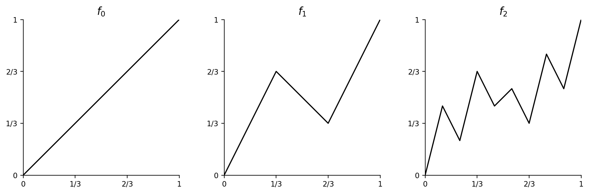

# corrigé zakito

[Énoncé](https://www.bourrigan.fr/data/td17-derivation.pdf)

## Autocorrection A

(i) Faux: la dérivabilité donne seulement la limite du quotient. Pour $f(x)=x^2$ en $a=0$, le quotient vaut $h$, jamais $f'(0)=0$ pour $h\ne0$.

(ii) Faux: pour $f(x)=|x|$ en $0$, le quotient différentiel n’a pas de limite, mais ne tend pas vers $+\infty$.

(iii) Faux: être dérivable sur les deux morceaux n’impose pas l’égalité des dérivées en $c$; $f(x)=|x-c|$ est un contre-exemple.

(iv) Faux: une fonction de dérivée nulle sur $\mathbb R^*$ est constante sur chacun des intervalles $]-\infty,0[$ et $]0,+\infty[$, mais les deux constantes peuvent différer.

(v) Vrai: $f(x)=\sqrt{x+1}$ tend vers $+\infty$ et $f'(x)=1/(2\sqrt{x+1})\to0$.

(vi) Faux: $f(x)=\sin(x^2)/x$ pour $x>0$, prolongée par $f(0)=0$, tend vers $0$, mais $f'(x)=2\cos(x^2)-\sin(x^2)/x^2$ n’a pas de limite nulle.

## Exercice 1

1. Domaine $]-\infty,1]$. $f(x)=|x|\sqrt{1-x}$. Elle est dérivable pour $x<1$, $x\ne0$, avec


```math
f'(x)=\begin{cases}-\sqrt{1-x}+\dfrac{x}{2\sqrt{1-x}},&x<0,\\[4pt]\sqrt{1-x}-\dfrac{x}{2\sqrt{1-x}},&0<x<1.\end{cases}
```


En $0$, les dérivées à gauche et à droite valent $-1$ et $1$; en $1$, le quotient différentiel est de taille $|x-1|^{-1/2}$, donc la dérivée n’est pas finie.

2. Domaine $[-1,1]$. Sur $]-1,1[$, la fonction est dérivable et


```math
f'(x)=2x\arccos(x^2)-\frac{2x(x^2-1)}{\sqrt{1-x^4}}.
```


Aux extrémités, le quotient différentiel tend vers $0$ puisque $(x^2-1)\arccos(x^2)=O((1-|x|)^{3/2})$; les dérivées unilatérales existent et valent $0$.

3. $x|x|=x^2$ si $x\ge0$ et $-x^2$ si $x<0$. Elle est dérivable partout, avec $f'(x)=2|x|$.

4. Domaine $\mathbb R$. Pour $x\ne0$, $f'(x)=1/(1+|x|)^2$. En $0$, $f(x)/x=1/(1+|x|)\to1$, donc $f'(0)=1$; dérivable sur $\mathbb R$.

## Exercice 2

Pour $x\ne0$, la fonction $1_{\mathbb Q}(x)x^2$ n’est pas continue: le long des rationnels elle tend vers $x^2$, le long des irrationnels vers $0$. En $0$, $|1_{\mathbb Q}(h)h^2/h|\le|h|\to0$, donc elle est dérivable et sa dérivée vaut $0$. Elle n’est dérivable qu’en $0$.

## Exercice 3

Si $f$ est paire, $f'(-x)=-f'(x)$; si $f$ est impaire, $f'(-x)=f'(x)$. Si $f$ est $T$-périodique, $f'(x+T)=f'(x)$.

## Exercice 4

On a $f_\lambda'(x)=\bigl(1-x^2-2\lambda x\bigr)/(1+x^2)^2$.

1. En $0$, $f_\lambda(0)=\lambda$ et $f_\lambda'(0)=1$, donc $T_\lambda(0):y=x+\lambda$; elles sont parallèles.
2. En $1$, $f_\lambda(1)=(1+\lambda)/2$ et $f_\lambda'(1)=-\lambda/2$. Ainsi $T_\lambda(1)$ a pour équation $y=-\lambda x/2+1/2+\lambda$. Toutes passent par $(2,1/2)$.

## Exercice 5

Hors de $1/2$, les compositions sont dérivables. Au raccord,


```math
g(1/2)=f(1),\qquad\lim_{x\to(1/2)^+}g(x)=f(0).
```


La continuité impose $f(0)=f(1)$. Sous cette condition,


```math
g'_-(1/2)=2f'(1),\qquad g'_+(1/2)=2f'(0).
```


```math
\boxed{g\text{ dérivable sur }[0,1]\iff f(0)=f(1)\text{ et }f'(0)=f'(1).}
```


## Exercice 6

Si $f(x_0)\ne g(x_0)$, le maximum coïncide localement avec la branche strictement supérieure et est dérivable. Si $f(x_0)=g(x_0)$, écrivons $h=f-g$. Le maximum vaut $g+\max(h,0)$; le quotient différentiel de $\max(h,0)$ a pour limites à droite $\max(h'(x_0),0)$ et à gauche $\min(h'(x_0),0)$. Elles coïncident si et seulement si $h'(x_0)=0$. Condition nécessaire et suffisante: $f(x_0)\ne g(x_0)$, ou bien $f(x_0)=g(x_0)$ et $f'(x_0)=g'(x_0)$.

## Exercice 7

1. Les sommets de $f_1$ sont $(0,0),(1/3,2/3),(2/3,1/3),(1,1)$. Ceux de $f_2$, dans l'ordre des abscisses $k/9$, sont


```math
0,\ \frac49,\ \frac29,\ \frac23,\ \frac49,\ \frac59,\ \frac13,\ \frac79,\ \frac59,\ 1.
```




2. (a) Les intervalles $[k/3^n,(k+1)/3^n]$, $0\le k<3^n$, forment un pavage de $[0,1]$; il en existe un contenant $x$.
(b) Si deux sommets consécutifs de $f_n$ diffèrent verticalement de $d$, les trois différences au rang suivant sont $2d/3,-d/3,2d/3$. La variation maximale $M_n$ vérifie donc $M_n\le(2/3)^n$. Sur une maille, $|f_{n+1}-f_n|\le M_n/3$. Pour $p>n$, $|f_p(x)-f_n(x)|\le\sum_{m=n}^{p-1}(2/3)^m/3$, ce qui tend vers $0$ quand $n\to\infty$; $(f_n(x))$ converge.

3. (a) En passant à la limite dans la borne précédente,


```math
|f_n(x)-f(x)|\le\sum_{m=n}^{\infty}\frac13(2/3)^m=(2/3)^n.
```


(b) La convergence est uniforme et chaque $f_n$ est continue; $f$ est continue.

4. (a) Par récurrence sur les subdivisions, $f_n(x)=2^n x$ sur $[0,3^{-n}]$. Ainsi $f(3^{-n})=(2/3)^n$.
(b) $[f(3^{-n})-f(0)]/3^{-n}=2^n\to+\infty$; la dérivée en $0$ n'existe pas comme nombre réel.
(c) Si $a=k/3^r$ est triadique, les pentes sur les mailles adjacentes de niveau $r$ sont non nulles. En raffinant depuis le côté droit de $a$, on prend à chaque étape la première sous-maille, dont la pente est le double de celle de la maille mère. Les pentes des cordes deviennent non bornées; la dérivée n'existe pas. Au bord $1$, on utilise les dernières sous-mailles.

5. (a) La différence s'écrit


```math
\frac{\eta_n}{\xi_n+\eta_n}\frac{h(a+\eta_n)-h(a)}{\eta_n}+\frac{\xi_n}{\xi_n+\eta_n}\frac{h(a)-h(a-\xi_n)}{\xi_n}.
```


Chaque quotient tend vers $h'(a)$; la combinaison convexe aussi.
(b) Si $a$ n'est pas triadique, soit $I_n=[k_n/3^n,(k_n+1)/3^n]$ l'unique maille de niveau $n$ qui le contient et $s_n$ sa pente, non nulle. Au raffinement, $s_n$ est multipliée par $2$ si $a$ reste dans un tiers extrême, par $-1$ s'il reste dans le tiers central. Si le premier cas arrive infiniment souvent, $|s_n|$ n'est pas borné; sinon les pentes alternent finalement de signe. Dans les deux cas elles ne convergent pas. La dérivabilité en $a$ imposerait leur convergence, par la question 5(a). Les points triadiques sont traités en 4(c), et les extrémités par les quotients unilatéraux.

## Exercice 8

L'argument du quotient symétrique est l'accroissement $h$, qui tend vers $0$.

### 1


```math
\frac{f(a+h)-f(a-h)}{2h}=\frac12\left(\frac{f(a+h)-f(a)}h+\frac{f(a-h)-f(a)}{-h}\right)\longrightarrow\boxed{f'(a)}.
```


### 2

Pour $f(x)=|x-a|$, le quotient symétrique est nul pour tout $h\ne0$, alors que $f'_-(a)=-1$ et $f'_+(a)=1$. La réciproque est fausse.

## Exercice 9

Le numérateur $N(x)=xf(a)-af(x)$ s'annule en $a$ et $N'(a)=f(a)-af'(a)$. Donc le quotient tend vers $f(a)-af'(a)$.

## Exercice 10

Posons $q(h)=f(h)-f(0)$. Par continuité en $h$ et densité de $\mathbb Q$, choisissons $r_h\in\mathbb Q$ tel que $|r_h-h|\le h^2$ et $|q(r_h)-q(h)|\le h^2$. Alors $r_h/h\to1$, tandis que l'hypothèse donne $q(r_h)/r_h\to1$. Ainsi $q(h)/h\to1$ et $f'(0)=1$.

## Exercice 11

Posons $A(h)=(f(h)-f(0))/h$, $h>0$. Alors $g(h)=2A(2h)-A(h)$. Si $A(h)\to L$, $g(h)\to L$. Réciproquement,


```math
A(h)=2^{-m}A(h/2^m)+\sum_{j=1}^m2^{-j}g(h/2^j).
```


Par continuité de $f$ en $0$, le premier terme tend vers $0$. Ainsi $A(h)=\sum_{j\ge1}2^{-j}g(h/2^j)$; si $g(t)\to L$, cette somme tend vers $L$. En effet, $|A(h)-L|\le\sup_{0<t\le h/2}|g(t)-L|\to0$. La limite finie de $g$ est donc $f'_+(0)$.

## Exercice 12

$f(x)=f'_+(0)x+o(x)$ quand $x\downarrow0$. Uniformément pour $1\le k\le n$, le reste est $o(k/n^2)$; donc


```math
\sum_{k=1}^n f(k/n^2)=\frac{f'_+(0)}{n^2}\frac{n(n+1)}2+o(1)\longrightarrow\frac12f'_+(0).
```


## Exercice 13

$y=0$ impose $f(0)=0$. Pour $y\to0$, $(f(x+y)-f(x))/y=(f(y)-f(0))/y\to f'(0)$; ainsi $f'(x)=f'(0)$ pour tout $x$. Les solutions sont $f(x)=cx$.

## Exercice 14

Pour $x>0$, $f(x)/x=f(x/2^n)/(x/2^n)$. Quand $n\to\infty$, le membre de droite tend vers $f'_+(0)=c$. Donc $f(x)=cx$; l'équation impose $f(0)=0$. Toutes ces fonctions conviennent.

## Exercice 15

### 1

Au rang $0$, la formule est celle de $f$. Si elle est vraie au rang $n$, poser $t=x+n\pi/6$. Alors


```math
f^{(n+1)}(x)=2^ne^{\sqrt3x}(\sqrt3\sin t+\cos t)=2^{n+1}e^{\sqrt3x}\sin\left(t+\frac\pi6\right).
```


Par récurrence,


```math
\boxed{f^{(n)}(x)=2^ne^{\sqrt3x}\sin\left(x+\frac{n\pi}6\right).}
```


### 2


```math
f(x)=\operatorname{Im}e^{(\sqrt3+i)x},\qquad\sqrt3+i=2e^{i\pi/6}.
```


```math
f^{(n)}(x)=\operatorname{Im}\left((\sqrt3+i)^ne^{(\sqrt3+i)x}\right)=2^ne^{\sqrt3x}\sin\left(x+\frac{n\pi}6\right).
```


## Autocorrection B

À un minimum local relatif à $[0,1]$, $[f(h)-f(0)]/h\ge0$ pour $h>0$ assez petit; donc $f'_+(0)\ge0$.

## Exercice 16

À un extremum intérieur, $f'(x_0)=0$. La croissance de $f'$ donne $f'(x)\le0$ si $x<x_0$ et $f'(x)\ge0$ si $x>x_0$. Le théorème des accroissements finis entraîne $f(x)\ge f(x_0)$ pour tout $x$ : c'est un minimum global.

## Exercice 17

La fonction $x\mapsto\ln(x)/x$ atteint son maximum en $e$, donc $n^{1/n}$ décroît pour $n\ge3$. Comme $(3^{1/3})^6=9>8=(2^{1/2})^6$, le maximum vaut $\sqrt[3]3$, atteint en $n=3$.

## Exercice 18

Pour $x>0$, $f'(x)=e^{-1/x}x^{-2}(\sqrt2+\sin(1/x)-\cos(1/x))\ge0$. Pour $x<0$, $f'(x)=-e^{1/x}x^{-2}(\sqrt2+\sin(1/x)+\cos(1/x))\le0$, car $\sin t+\cos t\ge-\sqrt2$. Les zéros de $f'$ sont isolés sur chaque demi-droite ; la fonction est donc strictement décroissante sur $(-\infty,0)$ et strictement croissante sur $(0,+\infty)$. Comme $f(x)>0$ si $x\ne0$ et $f(0)=0$, son unique extremum local est le minimum strict en $0$.

## Autocorrection C

Posons $F(x)=ax^4+bx^3+cx^2-(a+b+c)x$. On a $F(0)=F(1)=0$; le théorème de Rolle donne $x\in(0,1)$ avec $F'(x)=0$, soit $4ax^3+3bx^2+2cx=a+b+c$.

## Exercice 19

1. $\varphi'(x)=f'(\tan x)(1+\tan^2x)$ sur $]-\pi/2,\pi/2[$.
2. Les deux limites aux bords valent la même limite $\ell$; définir $\widetilde\varphi(\pm\pi/2)=\ell$ donne un prolongement continu.
3. Le théorème de Rolle sur $[-\pi/2,\pi/2]$ donne $c$ intérieur avec $\varphi'(c)=0$.
4. Comme $1+\tan^2c>0$, $f'(\tan c)=0$.

Seconde méthode : si $f$ est constante, $f'\equiv0$. Sinon choisir $x_0$ tel que $f(x_0)\ne\ell$ et une valeur $y$ strictement entre $f(x_0)$ et $\ell$. Par continuité et les limites aux deux infinis, il existe $x_-<x_0<x_+$ avec $f(x_-)=f(x_+)=y$. Rolle sur $[x_-,x_+]$ donne un zéro de $f'$.

## Exercice 20

Posons $g(x)=f(x)/x$ pour $x\ne0$ et $g(0)=0$. Comme $f'(0)=f(0)=0$, $g$ est continue en $0$; $g(0)=g(a)=0$. Rolle fournit $c$ strictement entre $0$ et $a$, donc $c\ne0$, avec $g'(c)=0$. Ainsi $cf'(c)-f(c)=0$: la tangente au graphe en $c$ passe par l'origine.

## Exercice 21

1. Supposons $a<b$ et $f'(a)>0>f'(b)$ (l'autre ordre se traite en minimisant). Près de $a$, $f$ prend à droite une valeur supérieure à $f(a)$; près de $b$, elle prend à gauche une valeur supérieure à $f(b)$. Le maximum de $f$ sur $[a,b]$ est donc atteint en un point intérieur $c$, où $f'(c)=0$.
2. Soit $y$ strictement compris entre $f'(a)$ et $f'(b)$. Appliquer la question 1 à $F(x)=f(x)-yx$ donne $c$ avec $F'(c)=0$, donc $f'(c)=y$. Les valeurs extrêmes sont déjà prises; ainsi $f'(J)$ est un intervalle.

## Exercice 22

Pour tout $A>0$, il existe $X$ tel que $f'(t)\ge A$ pour $t\ge X$. Pour $x>X$, le théorème des accroissements finis donne $f(x)-f(X)\ge A(x-X)$; donc $f(x)\to+\infty$.

## Exercice 23

1. Fixons $0<\varepsilon<1$. Pour $x$ assez grand, $f'(x)\ge(1-\varepsilon)/x$. La fonction $f(x)-(1-\varepsilon)\ln x$ est alors croissante; donc $f(x)\ge(1-\varepsilon)\ln x+O(1)\to+\infty$.
2. Oui : $f(x)=\ln(\ln(e+x^2))$ est dérivable sur $\mathbb R$, tend vers $+\infty$, et


```math
xf'(x)=\frac{2x^2}{(e+x^2)\ln(e+x^2)}\longrightarrow0.
```


## Exercice 24

Pour $h>0$ assez petit, $f(a+h)>f(a)=f(b)$ puisque $f'(a)>0$. Le théorème des accroissements finis sur $[a+h,b]$ donne un point où


```math
f'(c)=\frac{f(b)-f(a+h)}{b-a-h}<0.
```


## Exercice 25

1. Poser $\widetilde f(0)=0$. Comme $f(x)=x+O(x^2)$, $\widetilde f$ est continue en $0$.
2. Pour $x\ne0$,


```math
f'(x)=1+4x\sin(1/x)-2\cos(1/x),
```


et $f'(0)=\lim_{x\to0}f(x)/x=1$.
3. Pour $x_n=1/(2n\pi)$, $f'(x_n)=1-2=-1$; tout voisinage de $0$ contient donc des points où la dérivée est négative. La fonction n'y est pas croissante.
4. Si $f$ était $C^1$, la continuité de $f'$ et $f'(0)=1$ impliqueraient $f'>0$ sur un voisinage de $0$, donc $f$ y serait croissante par le théorème des accroissements finis. Cela contredit 3; $f$ n'est pas de classe $C^1$.

## Exercice 26

La fonction $F=f^2$ vérifie $F'=2ff'\ge0$, donc elle est croissante. L'ensemble où $f\ne0$ est $\{F>0\}$, un intervalle terminal ouvert : il vaut $]T,+\infty[$ s'il est non vide et distinct de $\mathbb R$. Il peut aussi être vide ($f\equiv0$) ou égal à $\mathbb R$ ($f\equiv1$); l'énoncé imprimé omet ces cas.

## Exercice 27

Poser $h(t)=te^{1/t}$ sur $(0,+\infty)$. Alors


```math
h'(t)=e^{1/t}\left(1-\frac1t\right)\longrightarrow1.
```


Le théorème des accroissements finis donne $c_x\in(x,x+1)$ tel que


```math
(x+1)e^{1/(x+1)}-xe^{1/x}=h'(c_x).
```


Comme $c_x\to+\infty$, la limite vaut $\boxed1$.

## Exercice 28

Pour $x>0$, le théorème des accroissements finis donne $f(x)-f(0)=xf'(c)$ avec $c\in(0,x)$. La croissance de $f'$ implique $f'(c)\le f'(x)$; comme $f(0)=0$, $f(x)/x\le f'(x)$.

## Exercice 29

Fixer $\varepsilon>0$ et choisir $A>0$ tel que $|f'(t)-\ell|\le\varepsilon$ pour $t\ge A$. Par le théorème des accroissements finis, pour $x>A$,


```math
|f(x)-f(A)-\ell(x-A)|\le\varepsilon(x-A).
```


```math
\left|\frac{f(x)}x-\ell\right|\le\frac{|f(A)-\ell A|}{x}+\varepsilon\frac{x-A}{x}.
```


Le premier terme tend vers $0$ ; puis $\varepsilon\to0$ donne $\boxed{f(x)/x\to\ell}$.

## Exercice 30

Le domaine est $[0,+\infty[$. En $0$, $[\cos(\sqrt h)-1]/h\to-1/2$; la dérivée à droite existe et vaut $-1/2$.

## Exercice 31


```math
\left|\frac{2x}{1+x^2}\right|\le1\qquad\bigl((|x|-1)^2\ge0\bigr).
```


Le domaine est $\mathbb R$. Pour $x\ne\pm1$,


```math
f'(x)=\frac{2(1-x^2)}{(1+x^2)|1-x^2|}=\begin{cases}\dfrac2{1+x^2},&|x|<1,\\-\dfrac2{1+x^2},&|x|>1.\end{cases}
```


La fonction étant continue, le théorème de la limite de la dérivée donne


```math
f'_-(1)=1,\quad f'_+(1)=-1,\qquad f'_-(-1)=-1,\quad f'_+(-1)=1.
```


```math
\boxed{f\text{ est dérivable exactement sur }\mathbb R\setminus\{-1,1\}.}
```


## Exercice 32

### 1

Le théorème des accroissements finis appliqué à $\ln$ sur $[x,x+1]$ donne $c\in(x,x+1)$ tel que


```math
\ln(x+1)-\ln x=\frac1c,\qquad\boxed{\frac1{x+1}\le\ln(x+1)-\ln x\le\frac1x}.
```


### 2

Avec $H_n=\sum_{k=1}^n1/k$, sommer les deux inégalités, en décalant les indices pour la seconde :


```math
\ln(n+1)\le H_n\le1+\ln n\implies\boxed{\frac{H_n}{\ln n}\longrightarrow1}.
```


Pour $p\in\mathbb N^*$ fixé,


```math
\ln\frac{np+1}{n+1}\le\sum_{k=n+1}^{np}\frac1k\le\ln\frac{np}{n}=\ln p.
```


```math
\boxed{\sum_{k=n+1}^{np}\frac1k\longrightarrow\ln p.}
```


Pour $p=1$, la somme est vide et vaut $0$.

## Exercice 33

Soient $a<b$ dans $I$ et $N\ge1$. Poser $x_k=a+k(b-a)/N$. Alors


```math
|f(b)-f(a)|\le\sum_{k=0}^{N-1}|f(x_{k+1})-f(x_k)|\le CN\left(\frac{b-a}{N}\right)^\alpha=C(b-a)^\alpha N^{1-\alpha}.
```


Comme $\alpha>1$, le dernier membre tend vers $0$. Donc $f(a)=f(b)$ et $\boxed{f\text{ est constante}}$.

## Exercice 34

### 1(a)


```math
f(x)=\frac{e^x}{e^x+1},\qquad f'(x)=\frac{e^x}{(e^x+1)^2}>0.
```


$f$ est strictement croissante sur $\mathbb R$, avec limites $0$ en $-\infty$ et $1$ en $+\infty$.

### 1(b)


```math
f([0,1])=\left[\frac12,\frac e{e+1}\right]\subset[0,1].
```


La fonction $f(x)-x$ est continue, positive en $0$ et négative en $1$. Elle s'annule donc en un point $\ell\in(0,1)$.

### 1(c)


```math
0<f'(x)=\frac{e^x}{(e^x+1)^2}\le\frac14,
```


car $(e^x-1)^2\ge0$. Ainsi $|f(x)-f(y)|\le|x-y|/4$ : $f$ est contractante. Deux points fixes vérifieraient $|\ell_1-\ell_2|\le|\ell_1-\ell_2|/4$, donc le point fixe est unique.

### 1(d)

La stabilité donne $u_n\in[0,1]$. Par récurrence,


```math
|u_n-\ell|\le4^{-n}|u_0-\ell|\longrightarrow0,\qquad\boxed{u_n\longrightarrow\ell}.
```


### 2

Poser $g(x)=e^x/(x+2)$, définie pour $x\ne-2$. Alors


```math
g'(x)=\frac{e^x(x+1)}{(x+2)^2}.
```


Elle décroît sur $(-\infty,-2)$ de $0^-$ à $-\infty$, décroît sur $(-2,-1]$ de $+\infty$ à $1/e$, puis croît sur $[-1,+\infty)$ jusqu'à $+\infty$.

Sur $[0,1]$,


```math
g([0,1])=\left[\frac12,\frac e3\right]\subset[0,1],\qquad g(0)>0,\quad g(1)<1.
```


Il existe donc $L\in(0,1)$ tel que $g(L)=L$. De plus,


```math
g''(x)=\frac{e^x(x^2+2x+2)}{(x+2)^3}>0\qquad(0\le x\le1),
```


```math
0<g'(x)\le g'(1)=\frac{2e}{9}<1.
```


$g$ est contractante sur $[0,1]$, son point fixe $L$ y est unique, et


```math
|v_n-L|\le\left(\frac{2e}{9}\right)^n|v_0-L|\longrightarrow0,\qquad\boxed{v_n\longrightarrow L}.
```


## Exercice 35

Poser $h(x)=x^{1/x}=e^{(\ln x)/x}$ pour $x>0$. Alors


```math
h'(x)=x^{1/x}\frac{1-\ln x}{x^2}.
```


Par le théorème des accroissements finis, pour un $c_n\in(n,n+1)$,


```math
\frac{n^2}{\ln n}\left(\sqrt[n]n-\sqrt[n+1]{n+1}\right)=\frac{n^2}{c_n^2}\,c_n^{1/c_n}\,\frac{\ln c_n-1}{\ln n}.
```


Les trois facteurs tendent vers $1$, puisque $c_n/n\to1$. La limite vaut $\boxed1$.

## Exercice 36

Poser $M=\max_{[a,b]}f'$ et $h(x)=f(x)-Mx$. Alors $h'\le0$, donc $h$ est décroissante. L'hypothèse donne


```math
h(b)-h(a)=f(b)-f(a)-M(b-a)=0.
```


Pour tout $x\in[a,b]$, $h(a)\ge h(x)\ge h(b)=h(a)$, donc $h$ est constante. Ainsi


```math
\boxed{f(x)=f(a)+M(x-a)\quad(a\le x\le b).}
```


Réciproquement, toute fonction affine vérifie l'égalité.

## Exercice 37

Supposer $\inf_{\mathbb R}|f'|>0$. Il existe $\varepsilon>0$ tel que $|f'(x)|\ge\varepsilon$ pour tout $x$. Par continuité et le théorème des valeurs intermédiaires, $f'$ garde un signe constant.

Si $f'\ge\varepsilon$, pour $x<0$ le théorème des accroissements finis donne


```math
f(0)-f(x)\ge-\varepsilon x\implies f(x)\le f(0)+\varepsilon x\longrightarrow-\infty.
```


Si $f'\le-\varepsilon$, pour $x>0$ il donne $f(x)\le f(0)-\varepsilon x\to-\infty$. Les deux cas contredisent $f\ge0$.

Ainsi $\inf|f'|=0$. Choisir $x_n$ tel que $|f'(x_n)|<1/(n+1)$ :


```math
\boxed{f'(x_n)\longrightarrow0.}
```


## Exercice 38

### 1

$P_0=1$ convient. Si $f_n(x)=P_n(x)/(1-x)^{n+1}$, alors


```math
f_{n+1}(x)=xf_n'(x)=\frac{x((1-x)P_n'(x)+(n+1)P_n(x))}{(1-x)^{n+2}}.
```


Donc


```math
P_{n+1}=x(1-x)P_n'+(n+1)xP_n.
```


Écrire $P_n=\sum_{j=0}^na_jX^j$, avec $a_j\in\mathbb N$ et $a_n>0$. Pour $1\le j\le n+1$, le coefficient de $X^j$ dans $P_{n+1}$ est


```math
j a_j+(n+2-j)a_{j-1}\in\mathbb N,
```


avec $a_{n+1}=0$. Son coefficient dominant vaut $a_n>0$. Le terme constant est nul. Ainsi $\deg P_{n+1}=n+1$ et ses coefficients appartiennent à $\mathbb N$.

### 2

Pour $0<x<1$, un polynôme non nul à coefficients positifs ou nuls vérifie $P_n(x)>0$. Par conséquent


```math
\boxed{f_n(x)=\frac{P_n(x)}{(1-x)^{n+1}}>0.}
```


## Exercice 39

Par récurrence sur $p$, appliquer la formule de Leibniz au produit de $n$ facteurs. Dériver un terme d'indice $(k_1,\ldots,k_n)$ ajoute une dérivation à l'un des facteurs; les coefficients se regroupent selon l'identité multinomiale. Ainsi


```math
(f_1\cdots f_n)^{(p)}=\sum_{k_1+\cdots+k_n=p}\frac{p!}{k_1!\cdots k_n!}f_1^{(k_1)}\cdots f_n^{(k_n)}.
```


La somme est finie et chaque terme est continu, donc le produit appartient à $C^p(\mathbb R)$.

## Exercice 40

La composition $g=f\circ(x\mapsto1/x)$ appartient à $C^n(\mathbb R_+^*)$. Pour $n\ge1$, poser


```math
A_{n,p}=\binom np\frac{(n-1)!}{(n-p-1)!}\quad(0\le p<n),
```


et $A_{n,p}=0$ hors de ces indices. Au rang $1$, $g'(x)=-x^{-2}f'(1/x)$.

La dérivation d'un terme utilise


```math
\left(x^{-(2n-p)}f^{(n-p)}(1/x)\right)'=-(2n-p)x^{-(2n-p+1)}f^{(n-p)}(1/x)-x^{-(2n-p+2)}f^{(n-p+1)}(1/x).
```


Après regroupement, le coefficient au rang $n+1$ est


```math
A_{n,p}+(2n-p+1)A_{n,p-1}=A_{n+1,p},
```


identité obtenue en substituant les expressions factorielles. La récurrence donne


```math
\boxed{g^{(n)}(x)=(-1)^n\sum_{p=0}^{n-1}\binom np\frac{(n-1)(n-2)\cdots(n-p)}{x^{2n-p}}f^{(n-p)}(1/x).}
```


Le produit vide pour $p=0$ vaut $1$ ; pour $n=0$, on conserve simplement $g(x)=f(1/x)$.

## Exercice 41

### (i)


```math
|x\sin(1/x)|\le|x|\longrightarrow0.
```


Le prolongement par $f(0)=0$ est continu, mais $f(h)/h=\sin(1/h)$ n'a pas de limite : $\boxed{f\in C^0\setminus D^1}$.

### (ii)

Le prolongement par $0$ est continu et $f(h)/h=h\sin(1/h)\to0$, donc $f'(0)=0$. Pour $x\ne0$,


```math
f'(x)=2x\sin(1/x)-\cos(1/x),
```


sans limite en $0$. Ainsi $\boxed{f\in D^1(\mathbb R)\setminus C^1(\mathbb R)}$.

### (iii)

La fonction imprimée est $\sqrt x\sin x$ pour $x>0$, et $x^2$ pour $x\le0$. Elle est continue en $0$ et


```math
\frac{f(h)}h=\begin{cases}\dfrac{\sin h}{\sqrt h}\to0,&h>0,\\h\to0,&h<0.\end{cases}
```


Donc $f'(0)=0$. Pour $x>0$,


```math
f'(x)=\frac{\sin x}{2\sqrt x}+\sqrt x\cos x\sim\frac32\sqrt x\longrightarrow0.
```


À gauche, $f'(x)=2x\to0$ ; donc $f\in C^1$. Mais $f'(h)/h\sim3/(2\sqrt h)\to+\infty$ à droite : $f''(0)$ n'existe pas. Ainsi $\boxed{f\in C^1\setminus D^2}$.

### (iv)


```math
f(0)=a+b,\quad f(0^-)=1,\quad f'_-(0)=-1,\quad f'_+(0)=1+b.
```


La continuité équivaut à $a+b=1$. Sous cette condition, la dérivabilité équivaut à $b=-2$, donc $a=3$ ; les dérivées premières se raccordent alors continûment.

Pour $(a,b)=(3,-2)$,


```math
f''_-(0)=-1,\qquad f''_+(0)=-2.
```


Ainsi $f\in C^1\setminus D^2$. Si $a+b=1$ et $b\ne-2$, $f\in C^0\setminus D^1$ ; si $a+b\ne1$, aucun choix de la seule valeur en $0$ ne raccorde les deux limites latérales.

## Exercice 42

1. $f'(x)=e^x+1>0$ et les limites aux infinis sont $-\infty,+\infty$; $f$ est bijective.
2. Comme $f'(x)>0$, la réciproque est dérivable. $f(0)=1$, donc $(f^{-1})'(1)=1/f'(0)=1/2$.
3. $(f^{-1})''(y)=-f''(x)/(f'(x))^3$ avec $x=f^{-1}(y)$. Ainsi $(f^{-1})''(1)=-1/8$.

## Exercice 43

Soient $x_0<\cdots<x_n$ des zéros distincts de $f$. Par le théorème de Rolle, $f'$ a au moins $n$ zéros entre eux; en répétant l'argument, $f^{(n)}$ s'annule.

## Exercice 44

Pour $n=0$, le résultat est $f(0)=0$. Si $n\ge1$, $f(0)=f(1)=0$, donc Rolle donne un zéro de $f'$ dans $]0,1[$. Avec $f'(1)=0$, une nouvelle application de Rolle donne un zéro de $f''$ entre ce point et $1$. En répétant, les conditions $f^{(k)}(1)=0$ donnent successivement un zéro de chaque dérivée, jusqu'à $f^{(n)}$.

## Exercice 45

Poser $g(x)=e^x(f'(x)-f(x))$. Les conditions aux bornes donnent $g(0)=g(1)=0$. Par Rolle, il existe $c\in(0,1)$ tel que


```math
0=g'(c)=e^c(f''(c)-f(c)).
```


Donc $\boxed{f''(c)=f(c)}$.

## Exercice 46

Soit $T>0$ une période de $f$. La dérivée $f'$ est continue et $T$-périodique, donc


```math
M=\max_{[0,T]}|f'|<\infty,\qquad|f'(x)|\le M\quad(x\in\mathbb R).
```


Pour $x<y$, si $f(y)=f(x)$, la majoration est immédiate. Sinon, poser


```math
u=\frac{f(y)-f(x)}{|f(y)-f(x)|},\qquad h(t)=\operatorname{Re}(\overline u f(t)).
```


Alors $h$ est réelle et $|h'|\le|f'|\le M$. Le théorème des accroissements finis donne


```math
|f(y)-f(x)|=h(y)-h(x)\le M(y-x).
```


Ainsi $\boxed{f\text{ est }M\text{-lipschitzienne}}$.

## Exercice 47

1. $P_0=1$. Si $f^{(n)}(x)=e^{-1/x}P_n(1/x)$, alors


```math
f^{(n+1)}(x)=e^{-1/x}\frac1{x^2}\left(P_n(1/x)-P'_n(1/x)\right),
```


ce qui donne un polynôme $P_{n+1}(t)=t^2(P_n(t)-P'_n(t))$.
2. Chaque dérivée sur $x>0$ est $e^{-1/x}$ fois un polynôme en $1/x$; elle tend vers $0$ en $0^+$. Par prolongement successif de toutes les dérivées, $f\in C^\infty(\mathbb R)$.
3. Soit $[a,b]\subset S$ un segment non trivial. La fonction


```math
h(x)=\begin{cases}\exp\!\left(-\dfrac1{1-((x-m)/r)^2}\right),&|x-m|<r,\\0,&|x-m|\ge r,\end{cases}\quad m=(a+b)/2,\ r=(b-a)/2,
```


est la composée $h(x)=f(1-((x-m)/r)^2)$, donc elle est lisse. Elle est positive sur $(a,b)$ et nulle hors de $S$.

## Exercice 48

Définissons $g(t)=f(\sqrt t)$ pour $t\ge0$. Pour $t>0$, $g'(t)=f'(\sqrt t)/(2\sqrt t)$. Comme $f'(0)=0$ et $f''$ est continue, $f'(x)=f''(0)x+o(x)$, donc $g'(t)\to f''(0)/2$. En outre $[g(t)-g(0)]/t=[f(\sqrt t)-f(0)]/t\to f''(0)/2$, donc $g'(0)$ existe, vaut $f''(0)/2$, et $g\in C^1(\mathbb R_+)$. Enfin $f(x)=g(x^2)$.

## Exercice 49

1. Soit $M=\sup|f''|<\infty$. Pour $h>0$, le théorème des accroissements finis et $|f'(x)-f'(\xi)|\le Mh$ donnent


```math
|f'(x)|\le\frac{|f(x+h)-f(x)|}{h}+Mh.
```


À $h$ fixé, le premier terme tend vers $0$ quand $x\to\infty$; puis $h\to0$ donne $f'(x)\to0$.
2. Non. $f(x)=\sin(x^2)/x$ pour $x>0$, prolongée en $0$ par $0$, est $C^2$ et tend vers $0$, mais $f'(x)=2\cos(x^2)-\sin(x^2)/x^2$ ne tend pas vers $0$.

## Exercice 50

### 1(a)

Pour $\varepsilon>0$, couvrir chaque $N_k$ par des intervalles $J_{k,j}$ vérifiant


```math
N_k\subset\bigcup_{j\ge0}J_{k,j},\qquad\sum_{j\ge0}\ell(J_{k,j})\le\frac{\varepsilon}{2^{k+1}}.
```


La famille double est dénombrable et


```math
\bigcup_kN_k\subset\bigcup_{k,j}J_{k,j},\qquad\sum_{k,j}\ell(J_{k,j})\le\sum_{k\ge0}\frac{\varepsilon}{2^{k+1}}=\varepsilon.
```


Donc $\bigcup_kN_k$ est négligeable.

### 1(b)

Énumérer $\mathbb Q=\{q_0,q_1,\ldots\}$. Des intervalles centrés en $q_k$, de longueur $\varepsilon/2^{k+1}$, recouvrent $\mathbb Q$ avec longueur totale $\le\varepsilon$. Ainsi $\mathbb Q$ est négligeable et dense.

### 2

Fixer $m\ge1$ et $\eta>0$. L'ensemble


```math
O=\{x\in(-m-1,m+1):|f'(x)|<\eta\}
```


est ouvert et contient $K_m=\mathrm{Crit}(f)\cap[-m,m]$. Ses composantes connexes sont des intervalles ouverts disjoints $(J_j)$, en nombre au plus dénombrable puisque chacun contient un rationnel. Leur longueur totale vérifie


```math
\sum_j\ell(J_j)\le2m+2.
```


Pour $u,v\in J_j$, le théorème des accroissements finis donne $|f(u)-f(v)|\le\eta|u-v|$. L'image $f(J_j)$ est un intervalle de longueur au plus $\eta\ell(J_j)$. Par conséquent


```math
f(K_m)\subset\bigcup_j f(J_j),\qquad\sum_j\ell(f(J_j))\le\eta(2m+2).
```


Prendre $\eta=\varepsilon/(2m+2)$ : $f(K_m)$ est négligeable. Enfin


```math
f[\mathrm{Crit}(f)]=\bigcup_{m\ge1}f(K_m)
```


est négligeable par 1(a).

## Exercice 51

### 1

La borne imprimée est fausse pour une racine rationnelle $x$, en prenant $a/b=x$. On suppose donc $x$ irrationnel réel et $P\ne0$. Pour une racine non réelle, la borne découle directement de $|x-a/b|\ge|\operatorname{Im}x|>0$.

Les racines de $P$ sont isolées. Choisir $0<\delta\le1$ tel que $x$ soit la seule racine de $P$ dans $[x-\delta,x+\delta]$, puis poser


```math
M=\max\left(1,\max_{[x-\delta,x+\delta]}|P'|\right).
```


Si $|a/b-x|<\delta$, le nombre $a/b\ne x$ n'est pas racine de $P$, donc


```math
b^nP(a/b)\in\mathbb Z\setminus\{0\}\implies|P(a/b)|\ge\frac1{b^n}.
```


Le théorème des accroissements finis donne


```math
\frac1{b^n}\le|P(a/b)-P(x)|\le M|a/b-x|.
```


Si $|a/b-x|\ge\delta$, on a déjà $|a/b-x|\ge\delta/b^n$. Ainsi


```math
\boxed{\left|x-\frac ab\right|\ge\frac C{b^n},\qquad C=\min\left(\delta,\frac1M\right)>0.}
```


### 2(a)


```math
s_n=\sum_{k=0}^n2^{-k!},\qquad0<s_n\le\sum_{k=0}^n2^{-k}\le2.
```


La suite est croissante et majorée, donc $s_n\to L$. Pour $n\ge1$,


```math
0<L-s_n=\sum_{k=n+1}^{\infty}2^{-k!}<2\,2^{-(n+1)!}.
```


En effet, les exposants successifs augmentent d'au moins $1$, et les termes sont majorés par une suite géométrique de raison $1/2$.

### 2(b)

Écrire $s_n=A_n/2^{n!}$, avec $A_n\in\mathbb Z$. Si $L=A/B$ était rationnel, $L>s_n$ donnerait


```math
\frac1{B2^{n!}}\le L-s_n<2^{1-(n+1)!}\implies1<B2^{1-nn!},
```


impossible pour $n$ assez grand. Donc $L$ est irrationnel.

Si $L$ était racine d'un polynôme entier non nul de degré $d$, la question 1 donnerait une constante $C>0$ telle que


```math
C2^{-dn!}\le L-s_n<2^{1-(n+1)!}\implies C<2^{1-(n+1-d)n!}\longrightarrow0.
```


Contradiction : $\boxed{L\text{ est transcendant}}$.

## Exercice 52

Si $P=0$, il n'y a aucune solution. Sinon, poser $d=\deg P$ et $h(x)=P(x)-e^x$. Alors


```math
h^{(d+1)}(x)=-e^x<0.
```


Si $h$ avait $d+2$ zéros distincts, $d+1$ applications de Rolle imposeraient un zéro de $h^{(d+1)}$, contradiction. Ainsi


```math
\boxed{\#\{x\in\mathbb R:P(x)=e^x\}\le d+1.}
```


## Exercice 53

Supposer $P$ non constant, de degré $d\ge1$. Alors $|P(x)|\to+\infty$ lorsque $|x|\to\infty$. Les solutions de $P(x)=\cos x$ sont donc dans un segment compact.

Si elles sont en nombre infini, elles possèdent un point d'accumulation $a$. Pour $h=P-\cos$, la continuité donne $h(a)=0$. Les quotients différentiels le long des zéros donnent $h'(a)=0$ ; Rolle entre $a$ et ces zéros produit aussi une suite de zéros de $h'$ tendant vers $a$. En répétant,


```math
h^{(k)}(a)=0\qquad\text{pour tout }k\ge0.
```


Pour $k=d+1,d+2$, les dérivées de $P$ sont nulles, donc deux dérivées consécutives de $\cos$ s'annulent en $a$. Cela imposerait $\sin a=\cos a=0$, contradiction.

Ainsi $\boxed{P\text{ est constant}}$. Les constantes donnant une infinité de solutions sont exactement celles de $[-1,1]$.

## Exercice 54


```math
Q=P+P'+\cdots+P^{(n)}\implies Q'=P'+\cdots+P^{(n)}=Q-P.
```


Par conséquent


```math
\left(e^{-x}Q(x)\right)'=e^{-x}(Q'-Q)=-e^{-x}P(x)\le0.
```


La fonction $e^{-x}Q(x)$ est décroissante et, puisque $Q$ est polynomiale,


```math
\lim_{x\to+\infty}e^{-x}Q(x)=0.
```


Donc $e^{-x}Q(x)\ge0$ pour tout $x$, et $\boxed{Q(x)\ge0}$.
